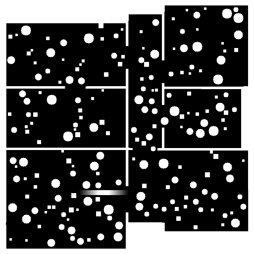

# Generación y postprocesado de nubes de puntos `.ply`

Este repositorio contiene los archivos necesarios para obtener una nube de puntos en formato `.ply` a partir de datos LiDAR en **Aerostack2** y realizar posteriormente un postprocesado en **MATLAB**.

El flujo general del proyecto consiste en capturar o generar una nube de puntos, filtrarla durante la ejecución en Aerostack2 y después analizarla en MATLAB mediante distintas representaciones y algoritmos de planificación.

## Estructura del repositorio

```text
.
├── aerostack2_code
│   ├── min_range_filter.py
│   └── route_behaviortree.xml
└── matlab_code
    ├── A_star.m
    ├── mapa.png
    ├── vis_2d.m
    └── vis_3d.m
```

## Archivos de Aerostack2

### `square.xml`

Este archivo se utiliza dentro de **Aerostack2** como un *Behavior Tree*. Define la lógica de comportamiento que debe seguir el sistema durante la ejecución de la misión.

En este caso, el árbol de comportamiento se emplea para ejecutar una trayectoria que permite obtener datos del entorno mediante el sensor LiDAR.

### `min_range_filter.py`

Este archivo implementa un nodo de filtrado para el tópico del LiDAR dentro de Aerostack2. El nodo se suscribe a un tópico de nube de puntos, elimina los puntos que están por debajo de una distancia mínima y publica una nube filtrada en otro tópico.

Por defecto, el nodo trabaja con los tópicos:

- `/drone0/sensor_measurements/lidar/points`
- `/drone0/sensor_measurements/lidar/points_filtered`

La distancia mínima de filtrado se define mediante el parámetro `min_range`, que por defecto está configurado a `0.35 m`.

Este filtrado ayuda a eliminar puntos demasiado cercanos al sensor, que pueden introducir ruido o dificultar el procesamiento posterior de la nube de puntos.

## Archivos de MATLAB

Los archivos `.m` se utilizan para postprocesar la nube de puntos `.ply` generada previamente.

### `vis_2d.m`

Este script permite representar la nube de puntos en 2D. Su objetivo es obtener una vista simplificada del entorno, útil para analizar la distribución de obstáculos sobre un plano.

### `vis_3d.m`

Este script permite visualizar la nube de puntos en 3D. Esta representación conserva la información espacial completa de la nube y resulta útil para inspeccionar la geometría del entorno de forma más detallada.

### `A_star.m`

Este script aplica el algoritmo A* sobre el mapa original. En este caso, se simula que se dispone del mapa 2D completo, por lo que el algoritmo puede planificar una trayectoria teniendo en cuenta toda la información del entorno.



La imagen del mapa representa el entorno sobre el que se realiza esta planificación, diferenciando entre zonas libres y obstáculos.

## Flujo de trabajo

1. Ejecutar la misión en Aerostack2 usando el *Behavior Tree* definido en `square.xml`.
2. Filtrar el tópico LiDAR mediante el nodo `min_range_filter.py`.
3. Exportar la nube de puntos resultante en formato `.ply`.
4. Procesar la nube de puntos en MATLAB.
5. Visualizar la nube en 2D con `vis_2d.m`.
6. Visualizar la nube en 3D con `vis_3d.m`.
7. Ejecutar A* con `A_star.m` sobre el mapa 2D original simulando como si fuera un mapa 2D completo generado a partir del .ply.

